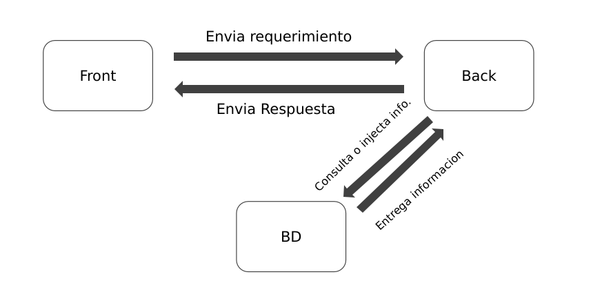

# desafio-01
first challenge for copernicus HR

Flujo de servicios para el desafio:

El desafío corresponde a la creación de una aplicación web utilizando Node y React.

A nivel de front, utilizando react, se debe confeccionar un sitio que conste de dos páginas, una en donde se de la bienvenida al usuario y se proporcione un contexto de la utilidad de la aplicación, y en la otra página se debe desplegar lo necesario para que el usuario suba un archivo csv y se genere algún insight de los datos que ha subido.
Este insight debe constar de cualquier información relevante que se pueda obtener a partir de analizar el archivo csv, pudiendo ser por ejemplo promedios, recuentos o cualquier otra información que se pueda desplegar de una manera sencilla, en esta página.
El procesamiento de esta información se debe realizar a nivel de backend en node
